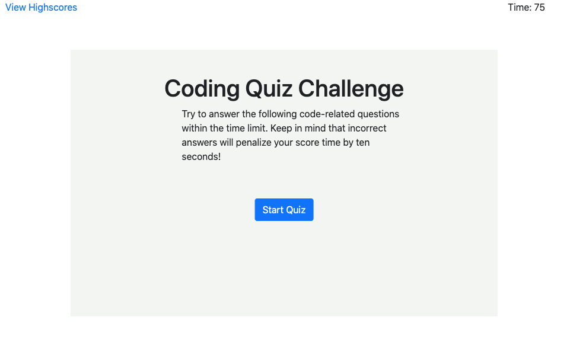
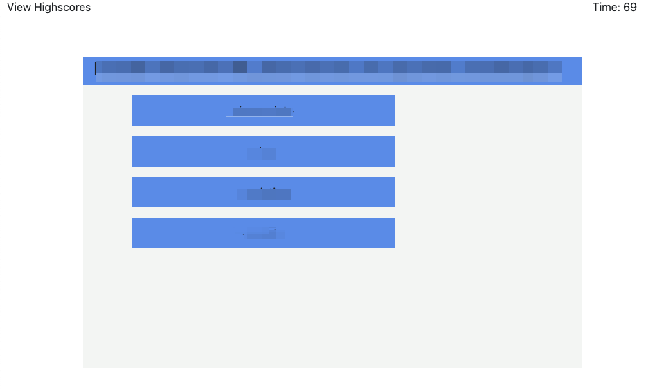
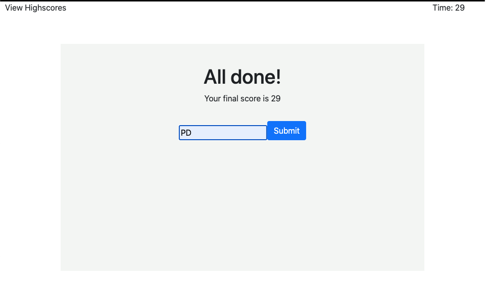
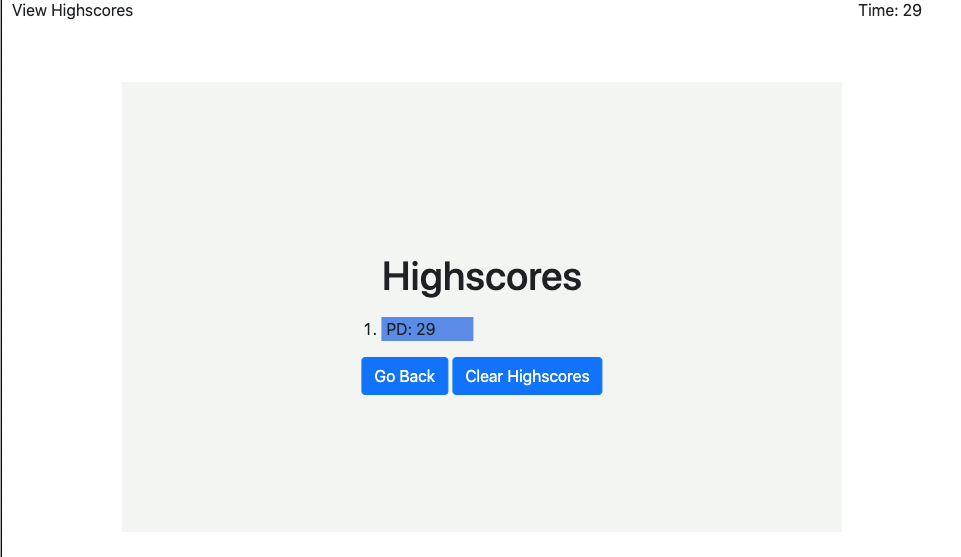

# code-quiz-on-time

## Description

This project is made from four main pages.
The first page is introductory to the user, so it explains the rules to complete the quiz effectively. The link from the top right corner goes to the last page where the user can see the top records of other participants.
\

Second page takes dynamic data from JS and changes the question when the User made a choice for the current question.

\

Third page shows users score; then, he or she is asked about initials to be added to the highscores page.

\

The last page is showing top scores, and it has a button to the beginning of the quiz and another button to clear highscores.

\

## Deployed link of the site

[Coding Quiz](https://paveldarii.github.io/code-quiz-on-time/)

## Copyright

Pavel Darii 2020
